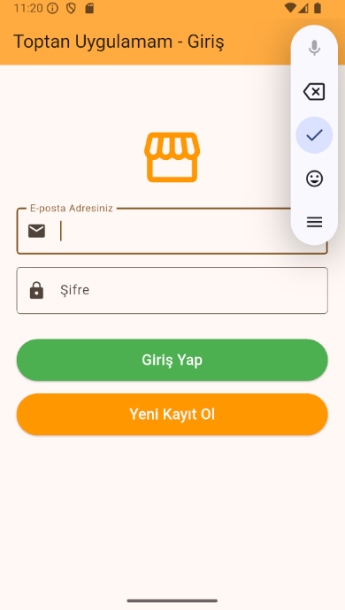
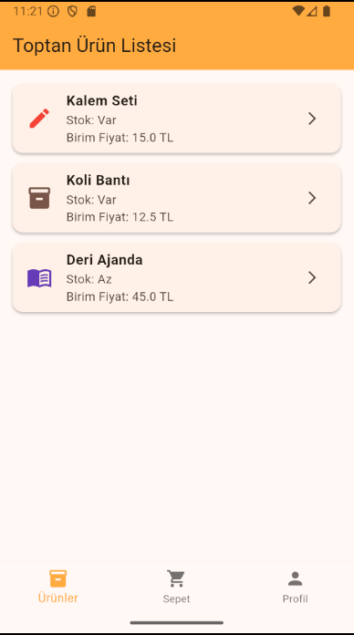
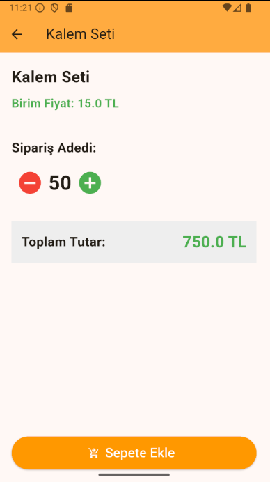
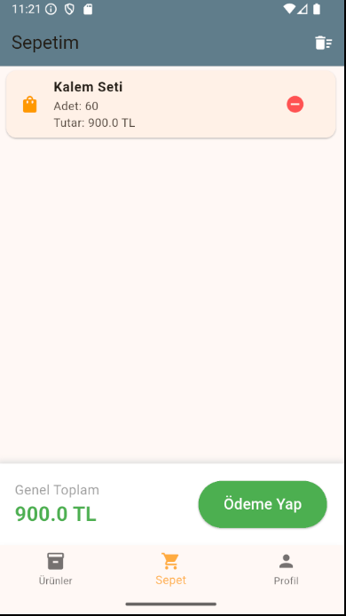
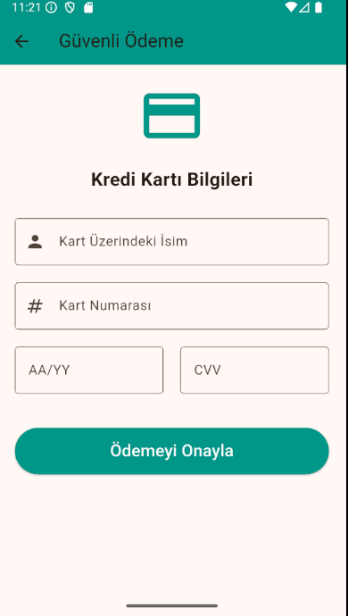
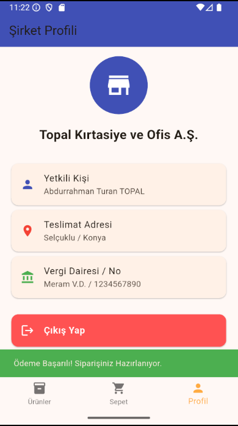

# 🛒 Toptan Satış ve Sipariş Uygulaması

Bu proje, toptan ürün siparişi vermek isteyen müşteriler için geliştirilmiş, Firebase altyapısına sahip bir B2B (Business to Business) mobil e-ticaret uygulamasıdır.

## 🚀 Özellikler
* **Güvenli Kimlik Doğrulama:** Firebase Auth ile E-posta/Şifre üzerinden kayıt ve giriş.
* **Ürün Listeleme:** Dinamik ürün kartları ve stok durumu takibi.
* **Akıllı Sepet Yönetimi:** Provider (State Management) kullanılarak anlık fiyat ve adet hesaplama.
* **Kullanıcı Dostu Arayüz:** BottomNavigationBar ile kesintisiz sayfa geçişleri.
* **Profil ve Çıkış:** Güvenli oturum kapatma ve şirket bilgileri görüntüleme.

## 📸 Ekran Görüntüleri

| Kayıt / Giriş Ekranı | Ürünler Sayfası |
|:---:|:---:|
|  |  |

| Ürün Detay ve Adet | Sepet ve Toplam Tutar |
|:---:|:---:|
|  |  |

| Ödeme Ekranı | Şirket Profili |
|:---:|:---:|
|  |  |

## 🛠 Kullanılan Teknolojiler
* **Framework:** Flutter (Dart)
* **Veritabanı ve Yetkilendirme:** Firebase Authentication
* **State Management:** Provider